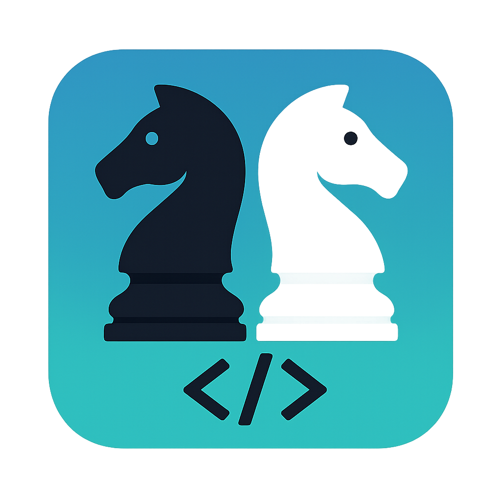

# qsvgchess

A feature-rich, modern chess application built with Python and PyQt5, featuring high-quality SVG graphics, engine analysis, and an interactive PGN browser.



## Features

- **High-Quality SVG Chessboard**: Crisp, responsive visuals using SVG rendering. Supports drag-and-drop piece movement and smooth animations.
- **Engine Analysis**: Built-in support for UCI chess engines (like Stockfish). Features a real-time evaluation bar, depth tracking, and best-line visualization.
- **Advanced PGN Browser**: 
  - Load and save PGN files.
  - Interactive move navigation with variation support.
  - HTML-styled move list with Light and Dark themes.
  - Add and edit comments directly on moves.
- **Puzzle Trainer**: A dedicated mode for practicing chess puzzles.
  - Free and Timed modes.
  - Hint system and move validation.
  - Session statistics and performance summaries.
- **Intuitive UI/UX**:
  - Modern Dark Theme (custom QSS).
  - Legal move highlighting (dots/circles).
  - Elegant pawn promotion dialog with graphical icons.
  - Board flipping and layout customization.
  - Splash screen for a polished startup experience.

## Installation

### Prerequisites

- Python 3.8+
- [Stockfish](https://stockfishchess.org/download/) (or any UCI-compatible engine) installed and available in your PATH.

### Setup

1. Clone the repository:
   ```bash
   git clone https://github.com/alexanderortizcuellar/qchess.git
   cd qchess
   ```

2. Install the required Python dependencies:
   ```bash
   pip install PyQt5 chess qtawesome
   ```

## How to Run

Launch the application by running the `main.py` script located in the `src` directory:

```bash
python src/main.py
```

## Project Structure

- `src/main.py`: Entry point of the application, handles startup and styling.
- `src/puzzles.py`: Puzzle training module and UI.
- `src/gui/`: User interface components.
  - `app.py`: Main application window and core orchestration logic.
  - `widgets/`: Reusable UI components like `chessboard.py`, `eval_bar.py`, and `pgn_browser.py`.
  - `dialogs/`: UI dialogs for settings, variations, and board editing.
- `src/core/`: Core business logic.
  - `engine.py`: UCI engine wrapper for analysis and evaluation.
  - `move_manager.py`: Logic for managing game history, PGNs, and variations.
  - `opening_explorer.py`: Logic for exploring chess openings.
  - `pgn_parser.py`: PGN parsing utilities.
  - `pgn_to_html.py`: PGN to HTML conversion logic.
- `src/utils/`: Utility functions and helpers.
  - `helpers.py`: Common UI helper functions.
- `assets/`: Static assets like `style.qss` and `icon.png`.

## Technical Stack

- **Language**: Python
- **GUI Framework**: [PyQt5](https://www.riverbankcomputing.com/software/pyqt/)
- **Chess Logic**: [chess](https://github.com/niklasf/python-chess)
- **Graphics**: SVG via `QtSvg`
- **Icons**: [QtAwesome](https://github.com/spyder-ide/qtawesome)
