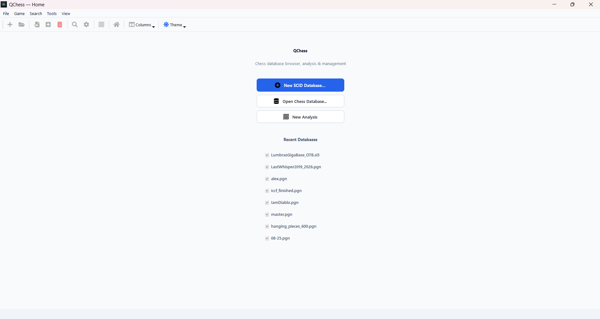
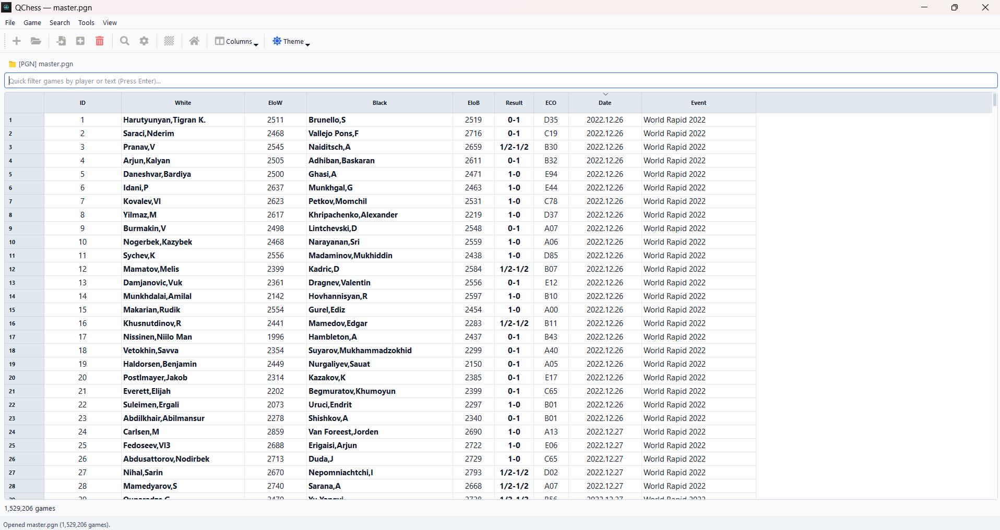
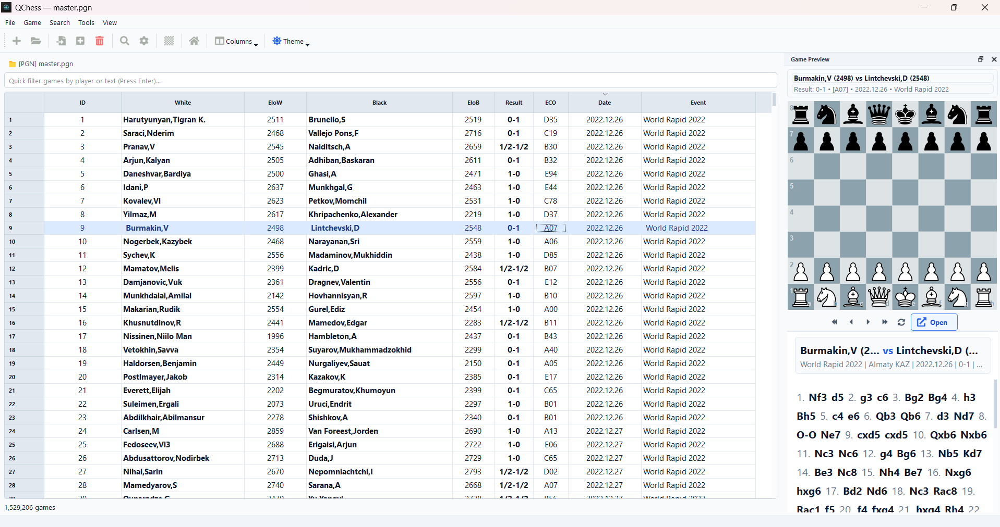
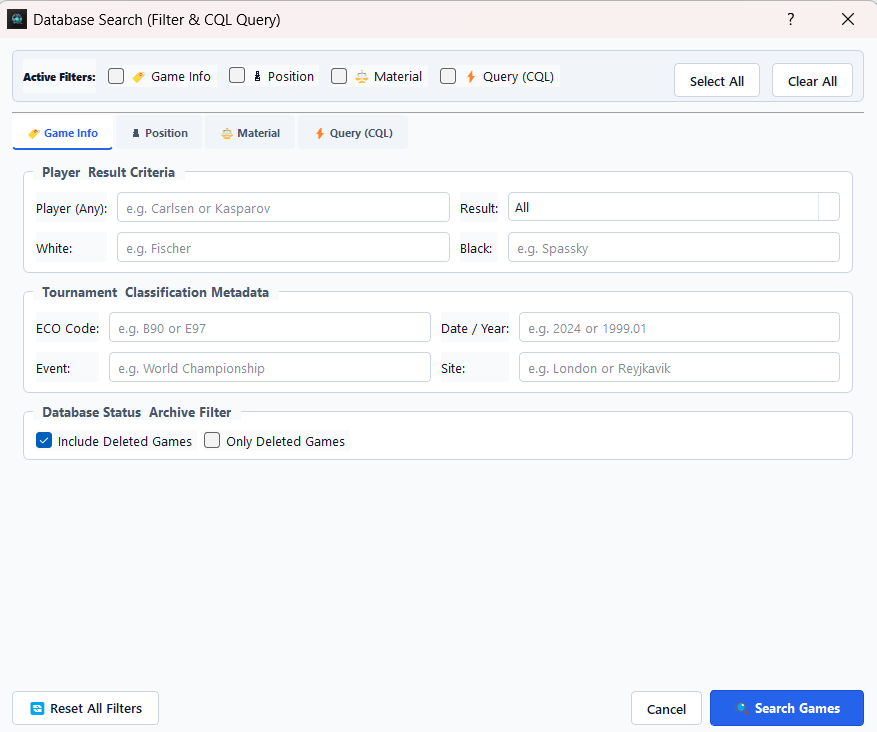
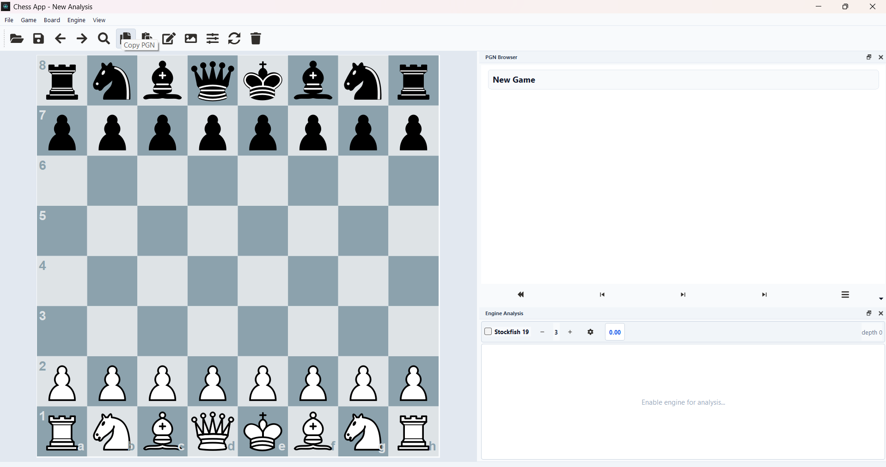
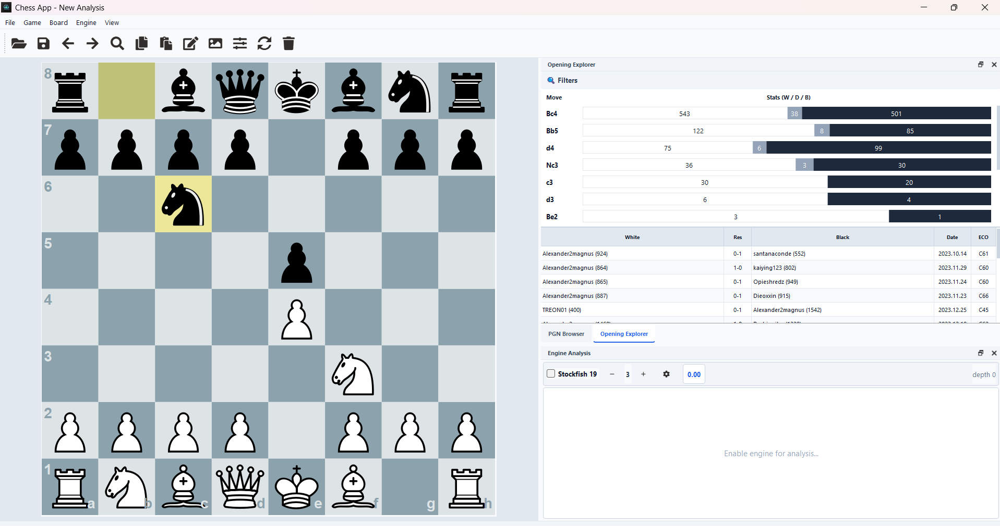
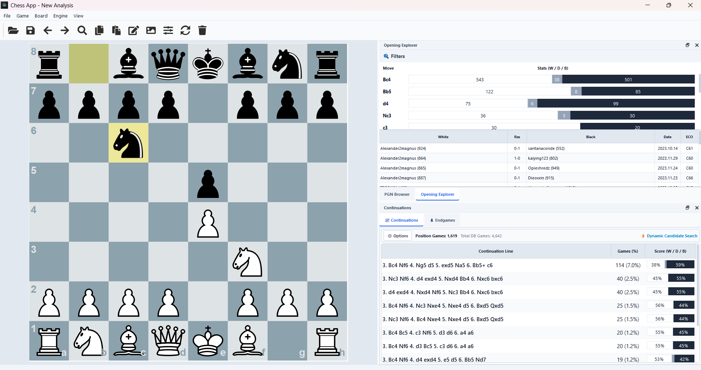
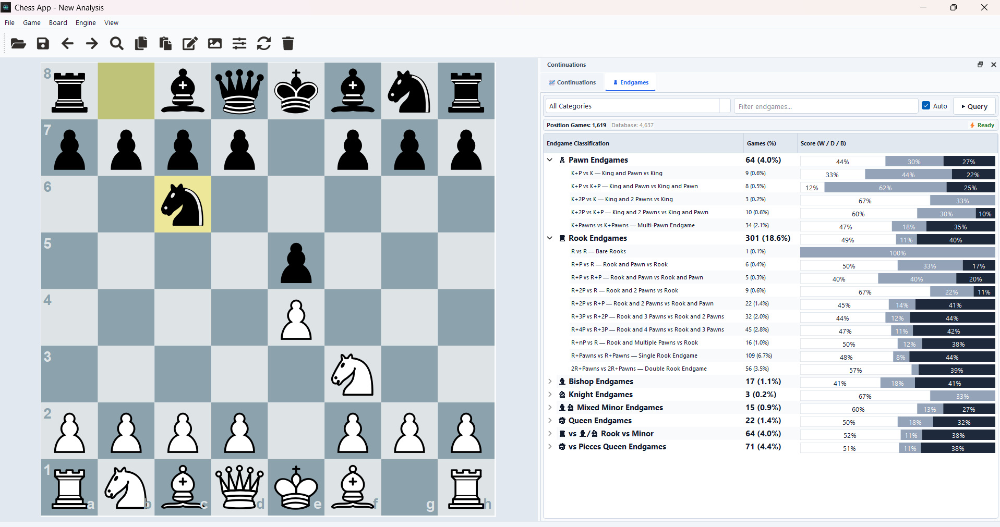

# QChess Screenshots & Visual Tour

A visual walkthrough of the main interfaces, database features, analysis tools, opening theory exploration, and endgame classification capabilities in **QChess**.

---

## 🏛️ Home Hub & Database Management

### 1. Landing Hub
The primary landing window with quick-launch actions, recent database shortcuts, and dockable panels.

---

### 2. Database Table View
High-performance database browser backed by the Rust `scid-mgr` engine, displaying indexed games, players, Elo ratings, ECO codes, dates, and results with instant column sorting.

---

### 3. Game Preview Dock
Interactive live game preview pane within the database browser, allowing quick replay and move inspection without launching the full analysis editor.

---

### 4. Advanced Search Dialog
ChessBase-style multi-tab search dialog supporting header filters (Players, Result, ECO, Event, Date), visual board position matching, and detailed material/endgame combinations.

---

## ♟️ Game Editor & Engine Analysis

### 5. Analysis Editor & Multi-PV UCI Engine
The main game editor window featuring the high-performance SVG chessboard, custom `QPainter` PGN browser with evaluation annotations, Stockfish evaluation bar, and live Multi-PV engine lines.

---

## 📚 Opening Theory & Continuations

### 6. Opening Explorer Tree View
Integrated opening statistics and book move tree showing move frequencies, win/draw/loss percentages, and ECO variations.

---

### 7. Multi-Move Continuation Lines
Deep theoretical exploration tab rendering complete variation sequences, popular continuation paths, and statistical evaluations.

---

## ⚖️ Endgame Classification

### 8. 47-Feature Endgame Classifier
Positional and material analyzer classifying endgames across 47 specific endgame categories and piece configurations for in-depth endgame study.

